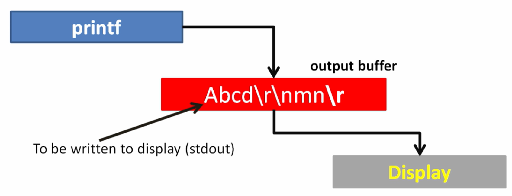

# Data types in C
- ### Memory sizes depend on the compiler; found in the documentation
- ### E.g. GCC compiler


<br>

## `char`


- ### E.g. printf() requires a `format specifier` to print the variables


- ### E.g. signed `char` representation

### `1's complement form:`
- ### is used to represent negative numbers (for signed integers)
- ### flipping all bits of binary representation of a positive number
- ### has 2 representations of zero: 0000 0000 and 1111 1111
### `2's complement form:`
- ### is used to represent negative numbers (for signed integers)
- ### flipping all bits of binary representation of a positive number and then add 1 to the least significant bit (LSB)
- ### has only 1 representation of zero: 0000 0000
### Hex value of `-25` is `0xE7`:
- ### split the 8-bit binary representation into two parts: 0001 1001


- ### E.g. Max and Min values of a signed `char` (saying just `char` implies signed by default)


- ### Unsigned `char` range is 0 to 255

<br>

## / `short` / `short int` (equivalent)


- ### E.g. signed `short` representation


- ### E.g. Max and Min values of a signed `short`


<br>

## `int`


<br>

## `long`


<br>

# Variables
- ### A variable acts as a label to a memory location where data is stored
- ### Variables names are not stored in memory; the compiler replaces them with their memory addresses
- ### E.g.


<br>

# Address Of `&`
- ### Returns the memory address of a variable
- ### E.g.
```
char a1 = 'A';
printf("%p", &a1);
```


- ### E.g. typecasting


<br>

# Storage Class specifiers
- ### `static`
	- ### Local variable that retains it's value between function calls
	- ### `static` variables are private to the file

- ### `extern`
	- ### Used to access a global variable which is defined outside of a file

<br>

# ASCII


<br>

# Typecasting
- ### Implicit casting = Done by the compiler
- ### Explicit casting = Done by the programmer
- ### E.g.


<br>

- ### E.g.


<br>

- ### E.g.


<br>

- ### E.g.


<br>

# Hexidecimals
- ### The prefix `0x` means hexadecimal notation
- ### The digits following `0x` can range from 0 - 9 and A - F, where A represents 10, B represents 11, and so on, up to F representing 15
- ### Each hexadecimal digit represents a group of 4 bits
	- ### Hexadecimal digit "0" represents the binary value "0000"
	- ### Hexadecimal digit "9" represents the binary value "1001"
	- ### Hexadecimal digit "F" represents the binary value "1111"

- ### E.g. Convert Hexadecimal to Decimal and vice versa
```
Hexidecimal number: 1A3

3 × 16^0 + 10 × 16^1 + 1 × 16^2

Decimal number: 419
```

```
Decimal number: 450

450/16 == 28, remainder 2
28/16 == 1, remainder 12 (C)
1/16 == 0, left remaining 1

Hexidecimal number: 1C2

```

<br>

# Compilation


<br>

# Floating point numbers (Real numbers)
- ### `Float` (32 bit, `Single precision`)
	- ### Precision: up to 6dp
	- ### Range: 1.2E-38 to 3.4E+38
- ### `Double` (64 bit, `Double precision`) - Default
	- ### Precision: up to 15dp
	- ### Range: 2.3E-308 to 1.7E+308


- ### IEEE-754 Standard


- ### Storing large floats in binary would consume too much memory, instead approximate the number and only store the required information...
	- ### `Sign`
	- ### `Exponent`
	- ### `Mantissa` (Significand)


- ### Which formats to store a float?
	- ### `Single Precision` (32 bit)
	- ### `Double Precision` (64 bit) - More accurate approximation


- ### `%lf`, `%f`, `%e`, `%le` format specifiers
	- ### E.g. `%0.2f` is 2dp for floats
	- ### E.g. `%0.13lf` is 13dp for doubles


<br>

# `scanf` - Read input


<br>

# `getChar` - Read single `char` input


<br>

# `printf` - Print output
- ### When your program returns, the contents of the `output buffer` are flushed to the display/console


<br>

# keyboard input
- ### When you type via the keyboard, the data goes to an `input buffer`


- ### E.g. input `10` then pressing the `Enter` key which results in `10` and `\n` in the input buffer
- ### The `scanf` only reads one `float`, `\n` remains.
- ### If there's another `scanf`, is disregards the `\n` because it's not a `float`, so waits until a `float` is entered, `\n` remains


