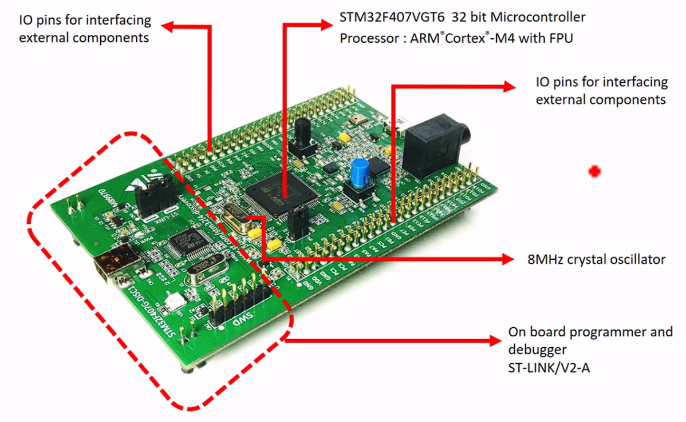
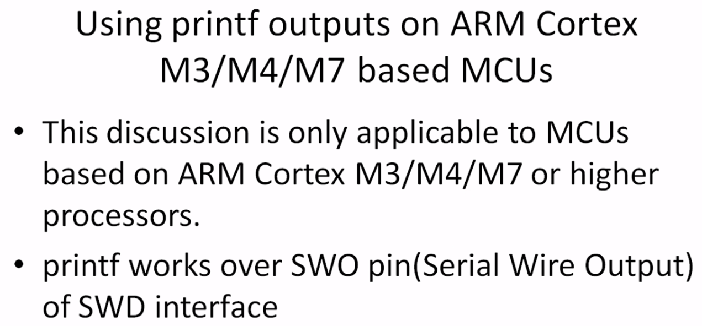
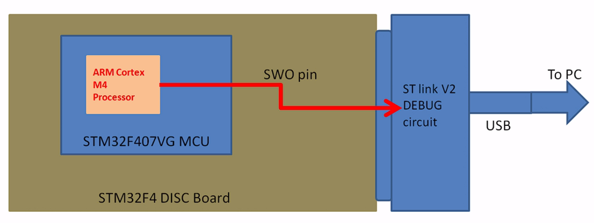
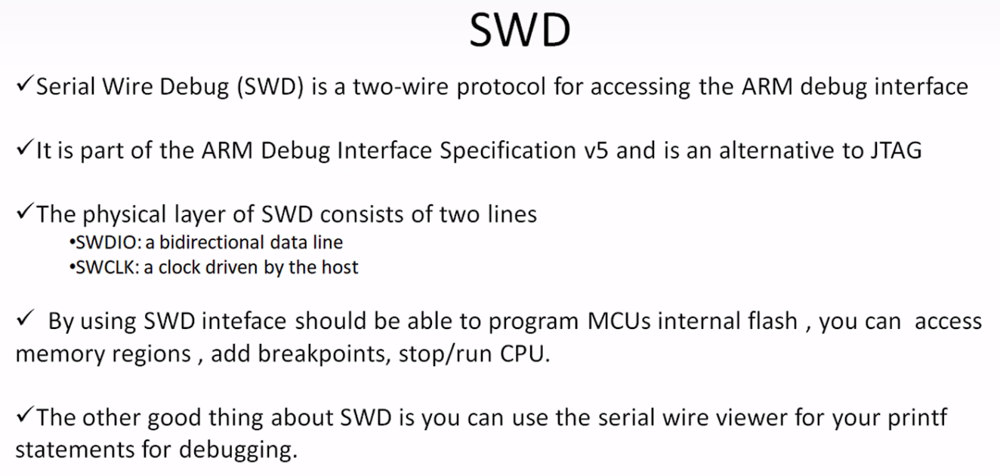
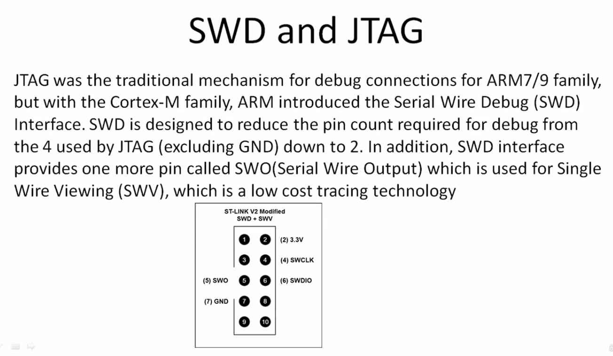
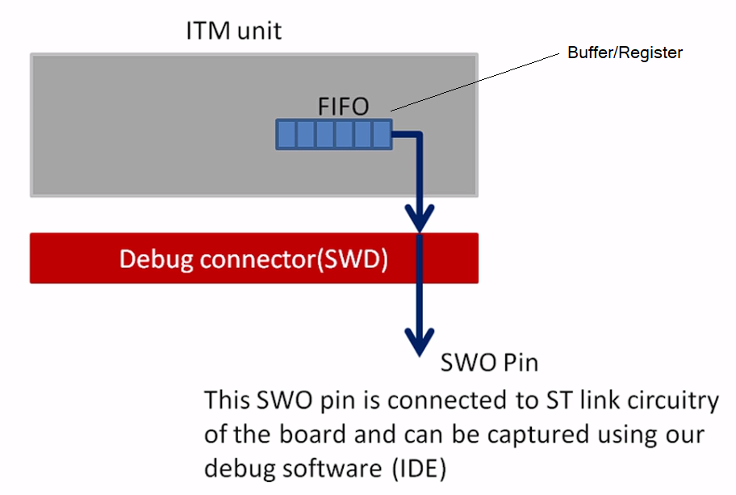
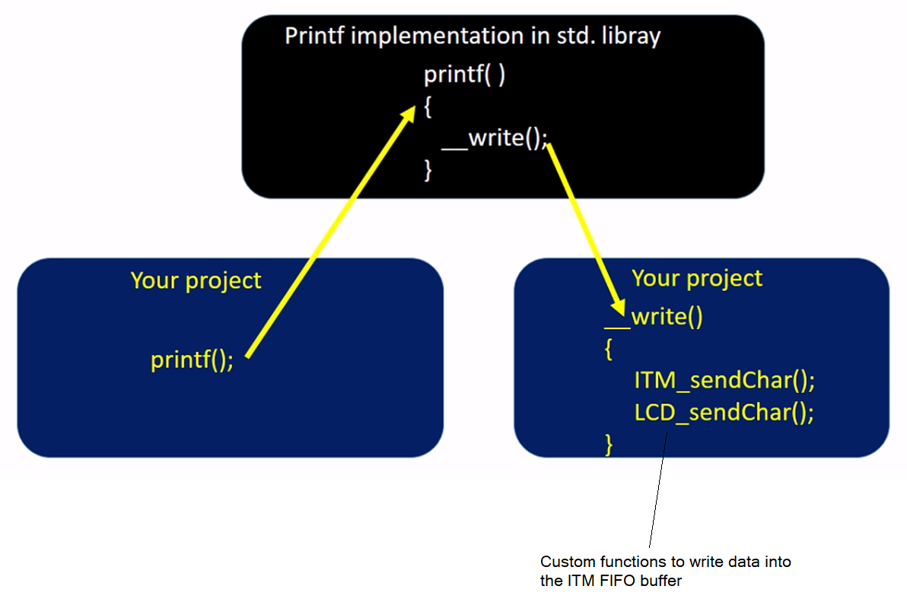
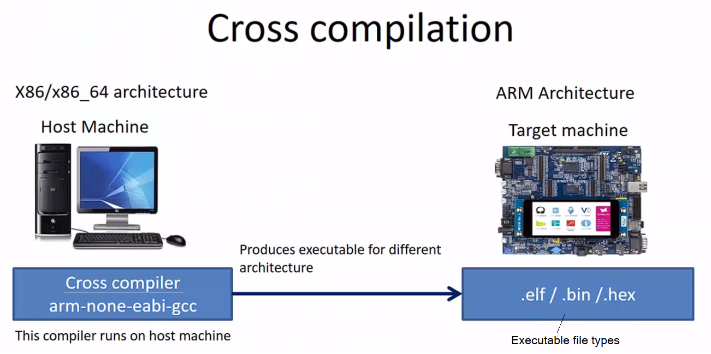
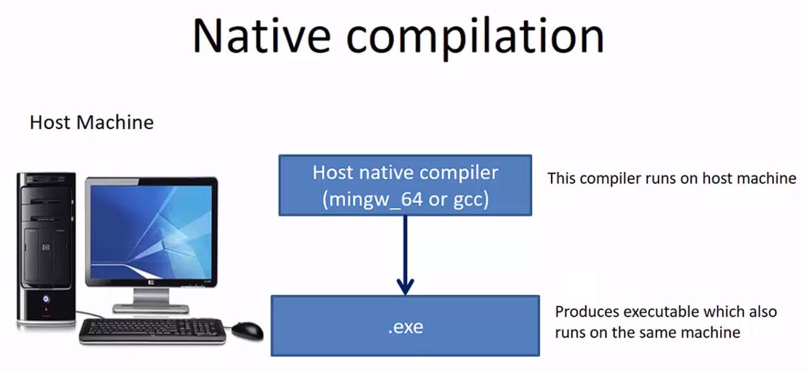

## STM32F407G-DISC1

 

# Debugging A Microcontroller Unit (MCU)

- ### PC communicates with the board through the `ST-Link` debug circuitry
	- ### By using the `ST-Link` circuitry, we can write programs to the flash memory of the `MCU`, read memory locations, make processor run...
- ### `SWO` pin connects the `MCU` processor to the debug circuitry

- ### Inside ARM Cortex-M3 or Cortex-M4 processors, there is a peripheral called an ***Instrumentation Trace Macrocell unit*** (`ITM`)
- ### We debug using a "Debug Interface", which in our case is the ***Serial Wire Debug***`SWD`
	- ### Read memory locations...
	- ### Read processor related register...
	- ### Make processor halt/run...

- ### `SWD` works over a `SWD` Connector, and that connector has 3 pins
	- ### 2 pins used for debug information
	- ### 1 pin (`SWO` pin) used for trace related information from processor
		- ### `SWDIO`
		- ### `SWCLK`

- ### Write some data into the FIFO Buffer (e.g. printf data), which is passed to the `SWO` pin, where in the STM32CubeIDE, we can capture the data from this pin
	- ### E.g. `printf()` -> `std` library -> `__write()` -> `ITM FIFO` -> `SWO` pin -> your IDE (`SVW ITM Data Console`)

 

- ### `FPU is not initialized, but the project is compiling for an FPU. Please initialize the FPU before use` warning in STM32CubeIDE when building a project
	- ### Solution: At Project -> Properties -> C/C++ Build -> Settings -> Tool Settings -> MCU Settings, set Floating-point unit to None, and Floating-point ABI to Software

 

# Cross-Compilation
- ### Compile a program with the intention of running it on a different architecture

- ### `.elf` is used for debugging
- ### `.bin`, `.hex` are used for production

 

# Native Compilation

 

# Running a Program in Debug mode in STM32CubeIDE
1. ### Connect the board to the PC
2. ### Right click Build the project (Compile)
3. ### Right click the project and `Debug as` -> `Debug Configurations`
4. ### `STM32 MCU Debugging`
	- ### Under `Debugger` tab, make sure `ST-LINK (ST-LINK GDB Server)` is selected as the `Debug Probe`
	- ### Under `GDB Server Command Line Options`
		- ### Make sure `SWD` is selected as the interface
		- ### Make sure `SVW` is enabled
	- ### Click `Apply` and close the window
5. ### Right click the project and `Debug as` -> `STM32 MCU C/C++ Application`
6. ### Now in debug perspective, Program is loaded into the target, and the processor's execution is halted at the first instruction of `main()`
7. ### To see trace logs, click `Window` -> `Show View` -> `SVW` -> `STM ITM Data Console`
8. ### In the `STM ITM Data Console`, click the icon to `Configure trace` and select a port to enable; if not sure, then select 0
9. ### In the `STM ITM Data Console`, click the icon to `Start trace`; `STM ITM Data Console` is now ready to accept data on the `SWO` pin
10. ### Click `Resume` to continue with processor execution of the program (May need to click `Reset the chip and restart debug session`, then click `Resume`)