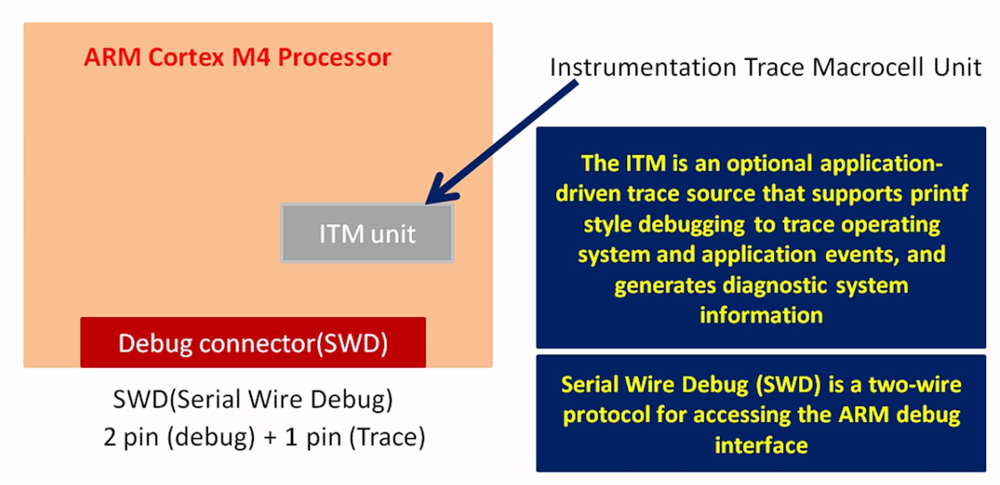
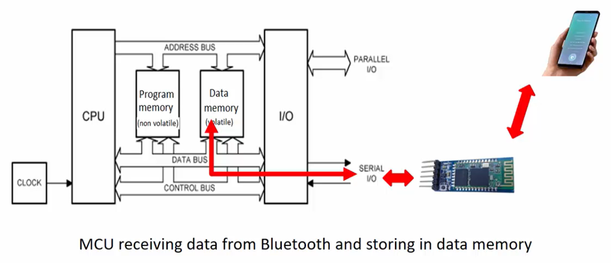

## STM32F407G-DISC1

 

# Debugging A Microcontroller Unit (MCU)

- ### PC communicates with the board through the `ST-Link` debug circuitry
	- ### By using the `ST-Link` circuitry, we can write programs to the `Flash memory` of the `MCU`, read memory locations, make processor run...
	- ### `Flash memory` is non-volatile memory, which means it retains the data even after the power is turned off
- ### `SWO` pin (trace pin) connects the `MCU` processor to the debug circuitry (STLINK)

- ### Inside ARM Cortex-M3 or Cortex-M4 processors, there is a peripheral called an ***Instrumentation Trace Macrocell unit*** (`ITM`)
- ### We debug using a "Debug Interface", which in our case is the ***Serial Wire Debug***`SWD`
	- ### Read memory locations...
	- ### Read processor related register...
	- ### Make processor halt/run...

- ### `SWD` works over a `SWD` Connector, and that connector has 3 pins
	- ### 2 pins used for debug information
	- ### 1 pin (`SWO` pin) used for trace related information from processor
		- ### `SWDIO`
		- ### `SWCLK`

- ### Write some data into the FIFO Buffer (e.g. printf data), which is passed to the `SWO` pin, where in the STM32CubeIDE, we can capture the data from this pin
	- ### E.g. `printf()` -> `std` library -> `__write()` -> `ITM FIFO` -> `SWO` pin -> your IDE (`SVW ITM Data Console`)

 

# Cross-Compilation
- ### Compile a program with the intention of running it on a different architecture

- ### `.elf` is used for debugging
- ### `.bin`, `.hex` are used for production

 

# Native Compilation

 

# What is a Microcontroller?

- ### `Program Memory` / `Code Memory` = Stores program instructions; Non-volatile memory
	- ### `Non-volatile memory` = Data persists even when power is turned off. E.g. `ROM`, `OTP`, `FLASH`, `FRAM`

- ### `Data Memory` = Stores data; Volatile memory
	- ### `Volatile memory` = Temporary data storage; data doesn't persist when power is turned off. E.g. `SRAM`

- ### `CPU` = "Processor" that reads from `Program memory` using `bus` interface and executes program instructions

- ### `CPU` instruction execution speed = Depends on the `Clock supply` of the `CPU`

- ### `Address bus` and `Data bus` = A `CPU` must first provide the memory address of an instruction via the `Address bus`, then read the instruction via the `Data bus`, then the `CPU` has a `Decorder` to decode the instruction

 

# Viewing Program/Code Memory
(reference from your microcontroller Reference Manual - E.g. under `Flash module organization STM32F40x and STM32F41x`)

- ### Flash - User can write to
	- ### Base address shown is `0x0800 0000`
	- ### Final address shown is `0x080F FFFF`
	- ### Paste address in STM32CubeIDE into the `Memory Browser` to view the contents of the memory address

- ### ROM / System Memory - User cannot write to this memory

 

# Viewing Data Memory
(reference from your microcontroller Reference Manual - E.g. under `Embedded SRAM`)

- ### Base address shown is `0x2000 0000`
- ### From the base address onwards, Data memory starts
- ### Paste address in STM32CubeIDE into the `Memory Browser` to view the contents of the memory address

 

# Analyzing `.elf` file using `GNU tools`
- ### `objdump`
	- ### Add `GNU tools` as a `Path` environment variable
		- ### E.g. `C:\ST\STM32CubeIDE_1.14.1\STM32CubeIDE\plugins\com.st.stm32cube.ide.mcu.externaltools.gnu-tools-for-stm32.11.3.rel1.win32_1.1.100.202309141235\tools\bin`
	- ### Run Command in the project directory where the `.elf` file is
		- ### E.g. `arm-none-eabi-objdump.exe -h [PROJECT-NAME].elf`
	

- ### `.text`, `.rodata`, `.data` are sections in the `./elf`

- ### `LMA` = Load Memory Address
	- ### Source in `Flash`
	- ### "Where the section is currently loaded"
- ### `VMA` = Virtual Memory Address
	- ### Destination in `SRAM`
	- ### "Where the section should finally be copied to"

- ### Startup files generated by STM32CubeIDE, copies data from `Flash` memory (at `LMA`) to `SRAM` memory (at `VMA`)
	- ### Copying `.data` section data from `Flash` memory to SRAM memory is necessary because:
		- ### Performance Optimization
			- ### Performing a read/write operation with `Flash` memory is slower than with `SRAM`; `SRAM` offers faster access times.
		- ### Modifyability
			- ### `SRAM` is volatile, meaning its contents are lost when power is turned off. On the other hand, `Flash` memory is non-volatile, retaining its contents even after power is turned off.

- ### `Reset_Handler` is an assembly routine, that is the 1st routine that get's called when the `MCU`/processor is powered on or reset

 

# Disassembling
- ### View assembly instructions from the machine code generated
	- ### In STM322CubeIDE, run project in debug mode and go to `Window` -> `Show View` -> `Disassembly`
	- ### Or run command `arm-none-eabi-objdump.exe -d [PROJECT-NAME].elf`
- ### Helpful if you want to carry out instruction level debugging (Instructions that the Processor executes)

- ### E.g.

